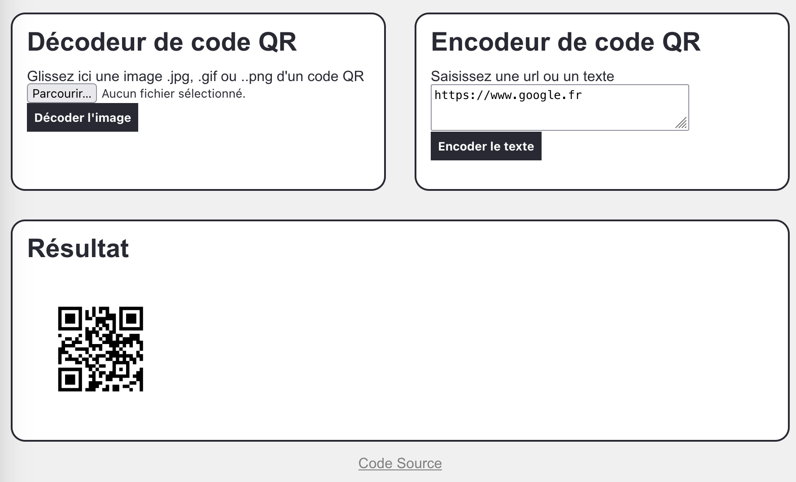

# qrdecode

Service web de décodage d'un code QR

On rencontre de nos jours de plus en plus de codes QR dans les magazines, les flyers, et même notre carte électorale ! Il y a bien des logiciels lecteurs prêts à l'emploi dans nos téléphone mais sait-on réellement ce qu'ils font exactement ? Afin de démystifier tout cela, et de façon libre, ouverte et auditable (bref un logiciel libre), voici ce mini projet.

Il prend la forme d'une application web qui accepte un upload d'image (.jpg,.png,.gif...) avec un code QR et affiche les données brutes qu'il contient. Ces données sont éventuellement codées et il faudra d'autres traitements afin de les lire.

À noter que ce projet est un sous ensemble du projet [vacdec](https://github.com/aerogus/vacdec) où ce dernier fait en plus le décodage du [certificat Covid européen](https://fr.wikipedia.org/wiki/Passe_sanitaire_europ%C3%A9en)

## Usage

Via Docker, pour instancier le conteneur après avoir construit l'image `qrdecode` :

```bash
docker run -p 80:80 --name qrdecode --rm -it $(docker build --tag qrcdecode --quiet .)
```

ou directement via l'interpréteur `python3`. La seule dépendance est la bibliothèque `zbar`

```
$ brew install zbar
$ pip3 install -r requirements.txt
$ python3 ./app/server.py
Serveur actif sur le port : 80
```

Allez sur http://127.0.0.1 et uploader l'image comme par exemple ce code QR qu'on retrouve sur les cartes électorales françaises 2022.


L'interface



## Ressources

- https://fr.wikipedia.org/wiki/Code_QR
- https://cpu.dascritch.net/post/2022/09/22/Ex0193-Datamatrix,-QR-code-et-autres-damiers
